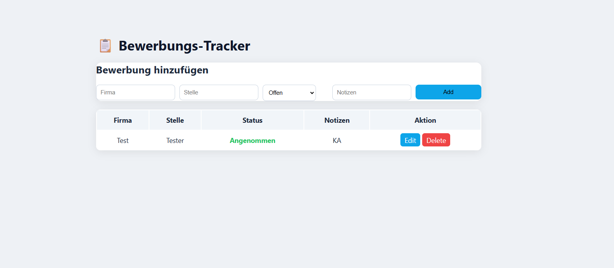

# 📋 Bewerbungs-Tracker (Flask)

A simple and professional web application to manage job applications.

---

##  Features

*  Add new applications
*  Edit existing applications
*  Delete applications
*  Data stored using SQLite
*  Clean and modern UI

---

##  Technologies

* Python (Flask)
* SQLite
* HTML / CSS

---

## 📸 Preview



---

##  How to Run

```bash
pip install flask
python app.py
```

Open in browser:

```
http://127.0.0.1:5000/
```

---

##  Purpose

This project was built as part of my learning journey in software development and demonstrates CRUD functionality using Flask.

---

## 👤 Author

Nizar Zoubani
